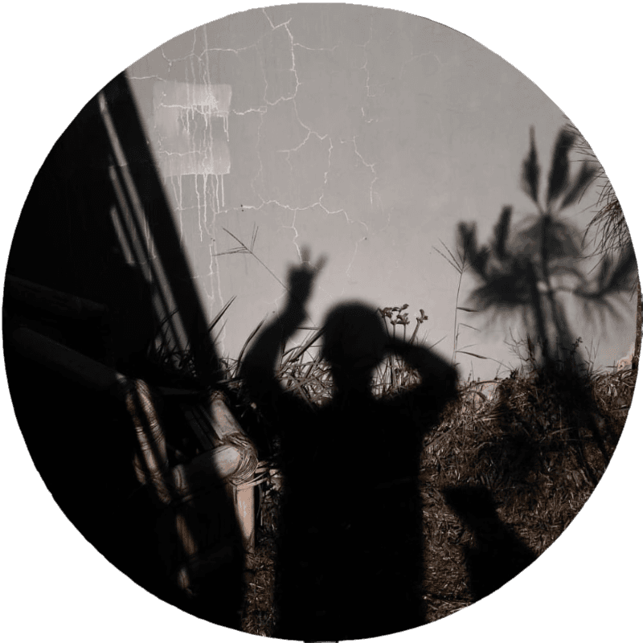
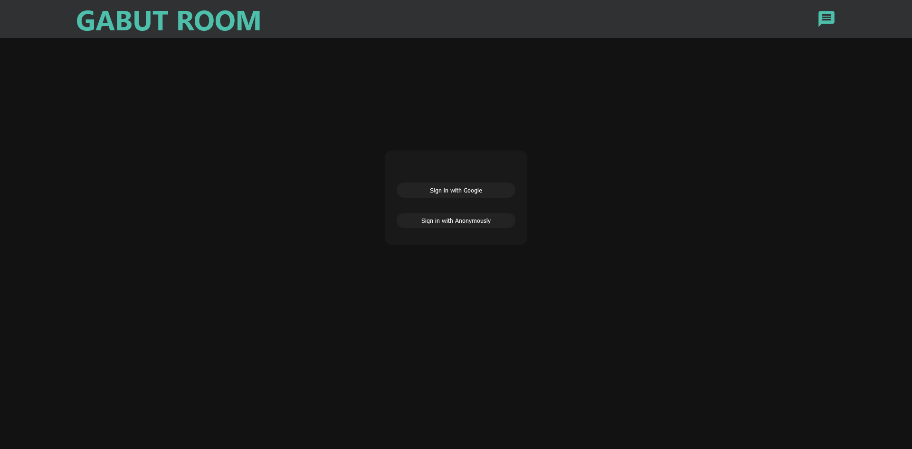

  

###

<h3 align="left">Connect with me:</h3>

###

<h1 align="center">hey there 👋</h1>

###

  

###

 <h4 align="left">💔 love has a cost, and both of us lost
</h4>

###

Support me

- 👉 🇮🇩 [Trakteer](https://trakteer.id/lrmn)
- 👉 🌍 [BuyMeACoffe](https://www.buymeacoffee.com/lrmn)
- 👉 🌍 [Ko-Fi](https://ko-fi.com/lrmn7)

## What is this?
it's a (very) basic chat website with a singular chat room (but technically more can be created with small adjustments) messages are not encrypted also number of messages displayed is limited to 25

supports Google sign-in and anonymous messages, uses HTTP-API to create hashed and unique avatars, thanks to https://avatars.dicebear.com/

check out https://gabutroom.vercel.app to try it!
please don't use profanity in the chat 😥

  

 